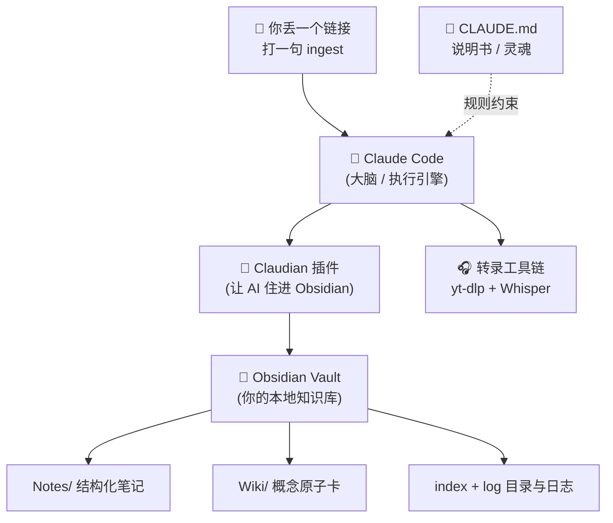
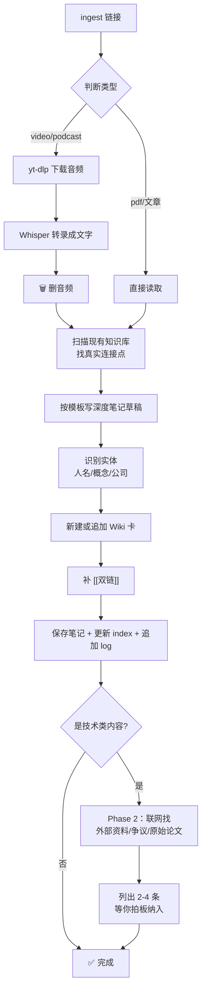
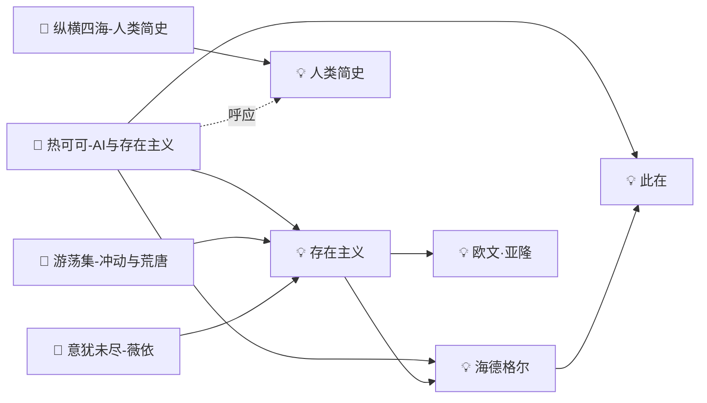

> 这是我小红书那篇《我把 Claude Code 调教成了知识库管家》的详细版。小红书放成果，这里放从 0 到 1 的完整过程——一个零基础的人，照着做也能搭起来。

我攒到现在 70+ 篇笔记、200+ 条双链，**没有一篇是我手动整理的**。

我只做一件事：丢一个播客 / 视频 / 文章链接，打一句 `ingest`。剩下的——下载、转录、读完、写笔记、抽概念、连双链、更目录——全是 AI 自己干。

这篇文章把这套系统拆开给你看：它由什么组成、每个零件干嘛、那份"灵魂说明书"怎么写、工作流怎么跑通。**不需要你会编程**，但需要你有耐心把环境配好。

---

## 零、先问：这套东西适合你吗？

动手前花一分钟判断——搭错方向，白费时间。

**适合这类人：**
- 你每周稳定消化 3 条以上的信息来源（播客、视频、论文、文章），觉得"看了就忘"很可惜
- 你有一个**聚焦的领域**——比如你是研究生在追踪某个学术方向，或者在系统学某个行业
- 你希望笔记之间能互相关联，而不是一堆孤立摘录
- 你愿意花半天配置，换来之后每次整理只说一句话

**适合这类内容：**
- 播客 / 视频（自动转录）
- 学术论文 PDF（加文献精读模块）
- 行业文章 / 博客（加信息源追踪）

**不太适合：**
- 偶尔记记笔记，没有持续输入习惯
- 信息来源极度分散，没有主题
- 完全不想碰命令行

> **一句话判断：** 如果你觉得"我消化了很多东西，但三个月后脑子里什么都剩不下"，这套系统就是为你设计的。

---

## 一、先看成果：它到底产出什么

口说无凭，先看一篇真实笔记长什么样。这是我丢进去一期讲"AI 与存在主义"的播客后，它自动生成的（节选）：

```markdown
---
source: https://podcasts.apple.com/.../id1808842834
type: podcast
date: 2026-05-27
tags: ["#personal", "#哲学", "#AI"]
wiki_links: ["[[海德格尔]]", "[[存在主义]]", "[[此在]]"]
---

## 摘要
这期播客的核心挑衅是：即便 AI 能完美模拟人类对话，它仍然
无法替代真实的人类连接，因为"关系"不是功能的执行，而是存在
本身的相遇……

## 核心要点
1. 人与人的连接源于"存在的厚度"，而非行为匹配 —— AI 再完美
   的回应也只是概率输出，缺乏每个真实人类都携带的独特历史……
2. "共在"是 AI 无法模拟的最后壁垒 —— 海德格尔强调，个体始终
   与他人沉浸在同一世界中……

## 值得深挖
### 批判性视角
播客的薄弱点在于：它强调人际连接的"不可控性"是优点，但没有
回答——对极度孤独或被伤害过的个体，这种"不可控的危险"是否
反而构成伦理困境？……

## 相关笔记
- [[人类简史]] — 虚构能力与人类合作的基础
```

注意几个细节，这是它和"普通 AI 摘要"的根本区别：

- **不是复述，是提炼**。摘要回答的是"这东西为什么值得存在"，不是"它讲了啥"。
- **有批判**。它会主动挑原内容的毛病，而不是一味赞美。
- **自动连接**。`[[海德格尔]]` `[[人类简史]]` 这些双链是它自己识别并接上去的——一个月后，所有聊过"存在主义"的笔记会自动汇成一张网。

这就是目标。下面讲怎么搭。

---

## 二、整体架构：三个零件

整套系统其实只有三个部分，外加一条转录工具链：



| 零件 | 角色 | 一句话 |
|------|------|--------|
| **Obsidian** | 仓库 | 本地纯文本知识库，笔记都在你自己电脑里 |
| **Claude Code** | 大脑 | 真正干活的 AI，会读文件、跑命令、写笔记 |
| **Claudian 插件** | 桥梁 | 让 Claude Code「住进」Obsidian，能直接读写你的库 |
| **`CLAUDE.md`** | 灵魂 | 给 AI 的说明书，定义它**怎么干活**——决定一切的就是它 |

前三个是工具，谁都能装。**真正决定效果的是第四个**——那份说明书。这篇文章一大半在讲它。

---

## 三、准备工作（按顺序来）

> 💡 **小白提示**：这一节是体力活，不难但琐碎。配不好后面都白搭，慢慢来。

**1. 装 Obsidian**
官网 [obsidian.md](https://obsidian.md) 下载，免费。新建一个文件夹当作你的 Vault（仓库），比如 `我的知识库`。

**2. 订阅并安装 Claude Code**
这是核心引擎，需要订阅（付费）。装好后在终端能用 `claude` 命令启动。

**3. 装 Claudian 插件**
它让 Claude Code 能直接读写 Obsidian。装好后，AI 就能在你的 Vault 里建文件、改文件、跑命令了。

**4. 配转录工具链（处理音视频才需要）**
- **`yt-dlp`**：从 YouTube / Bilibili / 播客抓音频。`brew install yt-dlp`。
- **转录 API**：我用 [Groq Whisper](https://groq.com)，速度快、有免费额度。也可以用本地的 `mlx-whisper` 兜底（不花钱但慢些）。


> ⚠️ 只处理文字 / PDF 的话，第 4 步可以先跳过。**建议先从纯文本跑通，再上音视频。**

---

## 四、灵魂：`CLAUDE.md` 怎么写

这份文件放在 Vault 里，Claude Code 每次启动都会读它，然后**严格照着做**。它就是你给 AI 立的"规矩"。

我的这份分成几大块，下面逐块拆给你看。

### 4.1 目录结构

先告诉 AI，你的库长什么样、东西该放哪：

```markdown
## 目录结构
- Notes/   每次入库生成的结构化笔记（一条来源一个文件）
- Wiki/    实体 / 概念页，由 AI 累积维护
- index.md Wiki 目录，每次更新
- log.md   操作日志（append-only，只追加不修改）
```

对应到磁盘上就是这样一棵树：

```text
我的知识库/
├── Notes/                    ← 每篇播客/视频/文章 = 一个文件
│   ├── 热可可-AI与存在主义.md
│   └── 纵横四海-人类简史.md
├── Wiki/                     ← 概念和人物的"原子卡"
│   ├── 存在主义.md
│   ├── 海德格尔.md
│   └── 人类简史.md
├── index.md                  ← 所有 Wiki 的目录
├── log.md                    ← 每次操作的流水账
└── CLAUDE.md                 ← 这份说明书本身
```

### 4.2 Note 模板（笔记长什么样）

这是最关键的一块。你要把"一篇好笔记的标准"写死，AI 才不会乱来。我的模板规定了**固定的正文顺序**：

```markdown
## 摘要
回答"这东西为什么值得存在、解决了什么更深的问题"，
而不是复述内容。200 字以内。

## 核心要点
每条必须包含一个具体的、可检验的断言——有数字、有对比、
或有反直觉的地方。禁止写"XX 很重要"这类空话。3-5 条。

## 值得深挖（有就写，没有就跳过）
- 与已知的连接：和库里已有的笔记/概念有什么呼应？
- 批判性视角：这个观点的局限是什么？有没有争议？
- 思想溯源：它为什么被设计成这样？更早的源头是什么？

## 相关笔记
用 [[文件名]] 链接到库里的其他笔记。
```

> 🔑 **为什么要这么细？** 因为你不写清楚，AI 就会偷懒——给你一段平庸的"内容简介"。把"核心要点必须有可检验的断言""禁止空话"这种标准写进去，产出质量天差地别。

### 4.3 Wiki 模板（概念怎么沉淀）

Notes 是"一次性"的（一篇来源一篇），Wiki 是"累积型"的（一个概念一张卡，反复追加）。规则：

```markdown
### 一句话定义
（20 字以内的简明定义）

### 核心内容
（累积更新。每次入库有新信息，追加到末尾，绝不覆盖旧的）

### 相关笔记
- [[笔记名]] — 一句话说明关联关系
```

铁律：**同一个概念只能有一张 Wiki 卡**；新信息只追加、不覆盖。这样"存在主义"这张卡会随着你听的内容越来越厚，变成你自己的概念词典。

### 4.4 反幻觉铁律（最容易被忽略，但最重要）

AI 最大的毛病是"凭印象编"。所以我在说明书里立了一条死规矩：

```markdown
## 铁律：忠于原文，禁止凭印象写作
写任何笔记之前，必须完整重读一遍转录稿 / 原文，不允许例外。
- 每条要点都要能在原文里找到对应的具体句子，不许"理解了大意"就写。
- 禁止用框架名词替代内容：写"DOES 模型中 O 代表过度刺激"是空话；
  写"走进嘈杂场合，所有声音像海浪同时涌来"才是内容。
- 笔记写完后逐条自检：每条要点有原文支撑吗？没有就重写。
```

这条规则，是整个系统可信度的地基。**没有它，你攒的就是一堆 AI 幻觉。**

---

## 五、手把手：用 Claude Code 对话把它搭出来

上面四节讲的是"应该是什么样"，这一节讲"第一句话说什么"。下面每个 prompt 都可以直接复制进 Claude Code，填好括号里的内容即可。

> **原则：** 我的架构是参考，不是标准答案。每个 prompt 里我都标注了「根据你的需求修改」的地方——请认真填，不要照搬我的领域和场景。

---

### 第一步：设计你的目录结构

不要急着搭，先把"你自己想要什么"想清楚，让 Claude Code 帮你设计：

```
我想用 Obsidian + Claude Code 搭一个个人知识库。

【我的使用场景】
我主要用来整理的内容类型是：[填你的，比如：学术论文/播客/行业文章/YouTube视频]
我的领域或主题是：[填你的，比如：跨文化管理/独立游戏开发/个人投资]
我每周大概会 ingest 几条：[填数字]
我希望笔记能支持的查询场景是：[比如：找某个研究方法/某个时间段/某个作者的内容]

【我的要求】
- 目录结构不超过 5 个顶层文件夹，简单清晰
- 笔记模板适合我上面填的内容类型
- 考虑以后用 Dataview 做动态查询

请帮我设计：
1. Obsidian 的目录结构（用树形图展示）
2. 笔记 frontmatter 模板（列出所有建议字段和说明）
3. 笔记正文结构（列出各区块名称和作用）

设计完后，请问我有没有要调整的，不要急着写 CLAUDE.md。
```

Claude Code 会给你一套方案，**来回确认几轮**直到你满意——这一步不要省。

---

### 第二步：生成你的 CLAUDE.md

结构确认好之后，再让它写说明书（接着上一步继续对话）：

```
好，结构我确认了。现在帮我写一份完整的 CLAUDE.md，放在 Obsidian Vault 根目录。

这份文件是 Claude Code 每次启动都会读取的操作说明书，语气要像给助手写工作手册——直接写规则，不要客气。

必须包含以下章节：

## 目录说明
（每个文件夹存什么）

## 文件命名规则
（格式：YYYY-MM-DD-{类型}-{slug}.md，附举例）

## Frontmatter 规范
（所有必填字段及填法）

## 笔记正文结构
（各区块名称和顺序，固定不变）

## ingest 工作流
触发方式：用户输入 `ingest <链接或文件路径>`
步骤：（判断内容类型→提取内容→写笔记→更新 Wiki→更新 index 和 log）

## Wiki 卡规则
（一个实体只能有一个页面，新信息追加不覆盖）

## 反幻觉铁律
（每条要点必须能在原文找到对应内容，禁止凭大意写作）

写好后把完整内容给我，我来决定要不要调整。
```

---

### 第三步：第一次 ingest 测试

CLAUDE.md 保存好之后，用**一条你已经看过的内容**做第一次测试——因为你知道内容，才能判断 AI 整理得准不准：

```
ingest [粘贴一个真实链接，或把文章正文粘贴进来]
```

跑完后**逐项检查**：
- 笔记文件是否按命名规则生成？
- Frontmatter 字段是否填完整？
- 摘要和要点，是否忠于原文？（最容易出问题）
- Wiki 卡是否生成，内容是否对？
- index.md 和 log.md 是否更新？

哪里不对，直接告诉它，不要手动改。

---

### 第四步：反馈迭代

测试完几乎一定有要调的地方。**关键：每次反馈都要同时更新 CLAUDE.md**，这样下次就不会再犯同样的问题：

```
刚才生成的笔记有个问题：[描述问题，比如：摘要太长了，超过了200字]

以后 ingest 时请改成：[描述你要的，比如：摘要必须控制在150字以内，用一句话说明来源的核心论点]

同时，请更新 CLAUDE.md 里的对应规则，把这条加进去。
```

这样迭代几次，系统就会越来越贴合你的习惯。我自己大概调了两周才觉得顺手。

---

## 六、核心工作流：`ingest` 全流程

说明书里最长的一节，是定义 `ingest` 命令到底干哪些步骤。我把它拆成两个阶段。



**Phase 1 — 快速出草稿**
判断类型 → 下载转录（音视频）→ **扫一遍现有库找连接点** → 按模板写笔记 → 抽出人名/概念建 Wiki → 接双链 → 存盘、更目录、记日志。这一步做完，一篇结构完整的笔记就有了。

**Phase 2 — 外部研究（只对技术类内容触发）**
草稿出来后，AI 自动联网，针对核心主题去找：作者本人的博客、X 上的深度讨论或争议、相关论文。它自己过滤掉垃圾，留 2-4 条有增量的，每条附一句"为什么值得读"，列给我确认。我点头的才会写进笔记的"外部资源精选"。

> 💡 人文 / 个人类的内容只走 Phase 1（不需要联网考据），技术类才走两阶段。这条分流规则也写在说明书里。

每跑完一次，`log.md` 追加一行流水账，像这样：

```text
[INGEST] 2026-05-27 podcast: 热可可《AI与存在主义》
         — 此在/共在/功能论陷阱 [Phase 1+2]
```

---

## 七、知识怎么长成一张网

单篇笔记不稀奇，**这套系统真正值钱的地方是双链**。

每篇笔记抽出的概念都会变成 Wiki 卡，笔记和卡之间、卡和卡之间用 `[[双链]]` 互相指。攒上一两个月，知识库就从"一堆孤立文件"长成一张可以漫游的网：



看那个 `存在主义` 节点——三篇不同的播客笔记都连到它。这意味着：当我哪天想做一期"关于存在主义"的内容，点开这张卡，所有相关素材自动在眼前，连它们之间的张力和呼应都被记下来了。

**这是手动整理永远做不到的**：你不可能记得三个月前那期播客和上周这篇文章其实在讲同一件事。但双链记得。

---

## 八、配套的几个小工作流

除了主力 `ingest`，我还在说明书里定义了几个辅助命令：

| 命令 | 干什么 |
|------|--------|
| `ingest lint` | 体检：找出没连双链的"孤儿笔记"、疑似重复的 Wiki 卡、index 漏掉的条目 |
| `处理队列` | 我平时把链接攒进一个看板，喊一声它就批量处理整个队列 |
| `关于 XX 你知道什么` | 反向查询：它搜遍全库合成回答，引用来源，还会把新洞见追加回 Wiki |

最后这个 `query` 特别爽——知识库不只是"存"，还能"问"。它答完之后，如果产生了新理解，会自己把这条理解追加到对应概念卡里。**库会越用越聪明。**

---

## 九、给小白的最小可行版（强烈建议从这开始）

全自动版本门槛不低。如果你是零基础，别一上来就配转录 API。按这个顺序爬：


1. **手动版**：找篇文章，把正文复制给 Claude，让它按上面的模板写一篇笔记，存进 Obsidian。先感受产出。
2. **半自动**：把模板和规则写成 `CLAUDE.md`，以后只说"按说明书整理这篇"，质量立刻稳定。
3. **全自动**：最后才接转录工具链，实现"丢链接 → 一句 `ingest` → 全自动"。

**先跑通最小闭环，再加自动化。** 一上来追求全自动，大概率卡在环境配置上劝退。

---

## 十、我踩过的坑

- **不写"反幻觉铁律"** → AI 张口就编，笔记全是似是而非的大意。这条必须有。
- **模板写得太松** → 产出像维基百科摘要，平庸无聊。标准定得越狠，笔记越好。
- **音频忘了删** → `/tmp` 塞满。我在工作流里强制"转录完立刻删音频和文字稿"。
- **概念卡重复** → 同一个概念建了两张卡，网就断了。靠 `lint` 定期查重合并。
- **一次性想全自动** → 卡在 API 配置上好几天。老实从手动版爬起来反而最快。

---

## 十一、写在最后

这套系统的精髓其实就一句话：**把"一个优秀的知识管理者会怎么做"，写成一份 AI 能严格执行的说明书。**

工具谁都能装，难的是想清楚"什么是一篇好笔记""知识之间该怎么连"。这部分想透了，剩下的交给 AI。

> 我完整的 `CLAUDE.md`（含分阶段研究、批量队列、反幻觉约束等）还在持续打磨。想要这份完整模板，去小红书找我，评论「AI知识库模板」。

后面我会继续把 `ingest` 工作流的每个细节、踩过的更多坑，更在这个花园里。关注小红书不迷路 🌱
